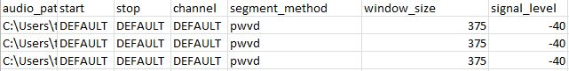
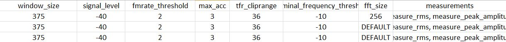

itsfm without coding
~~~~~~~~~~~~~~~~~~~~

Not so comfortable coding in Python? There is an option to use `itsfm`
by specifying the parameters you'd like to use for a segment and measure 
run. This means the sound will be segmented into FM and CF and measurements 
(custom/inbuilt) will be done on the detected sound parts. 

Running a batch file analysis
>>>>>>>>>>>>>>>>>>>>>>>>>>>>>
Remember to install the package as outlined in the main page. Running a batch file analysis is
as simple as typing the following command into the command line interface of your OS. 
`Remember to activate your conda/virtual environment if you're using one before!`

.. code-block:: shell

   python -m itsfm -batchfile path_to_your_batchfile_here.csv

Outputs from a batch file analysis
<<<<<<<<<<<<<<<<<<<<<<<<<<<<<<<<<<

#. Diagnostic plots : The batch file analysis will produce a pdf for each audio snippet processed. This pdf will have a series of diagnostic plots in each page for later inspection. 

#. Measurement file : A common long-format measurement csv file will be output. Each row in the file corresponds to one segmented region and each
   column corresponds to the default/custom measurements run on the segments. 

The batch file
<<<<<<<<<<<<<<
The batch file is a .csv file with the following layout

The basic idea is to give the same inputs that you would use while calling the :code:`itsfm.segment_and_measure_call`
function. All non-default arguments can be input as columns in the batchfile. The names of the columns must match 
the keyword used in a function call. 

A simple batch file
<<<<<<<<<<<<<<<<<<<
*Note* : if a keyword argument is not expicitly specified as a column with filled in values, the default value for this argument will be used. 

#. :code:`audio_path` : the path to the audio file 
#. :code:`start` : What time into the audio file should the sound be read? Defaults to 0. 
#. :code:`stop` : When does the relevant sound segment end? Defaults to the duration of the file. 
#. :code:`channel` : integer value. If file is a multichannel file, then choose relevant channel. *Note* : channel numbers start from 1 onwards. 
#. :code:`segment_method` : the CF-FM segmentation method to be used. 
#. :code:`window_size` : integer value. Number of samples to be used to calculate the moving dB rms window. 
#. :code:`signal_level` : float <=0. The value in dB rms (re 1) that defines a region of analysable signal. 

A batch file is extensible
<<<<<<<<<<<<<<<<<<<<<<<<<<
Depending on the extent of control you'd like to have on the analysis, you can add more arguments to control 
the output. For instance, take a look at the batch file below. This shows an extension of the previous batch file. 
In this particular batch file there are a whole bunch of other 

* :code:`fmrate_threshold` : float>0. The fm rate above which a region is consdered FM in kHz/ms. 

* :code:`max_acc` : float>0. The maximum `acceleration` that is allowed in the frequency profile. The acceleration is a proxy for how rough or spiky the frequency profile in a particular region. Values closer to 0 are better. 
   
* :code:`tfr_cliprange` : float>0. The maximum dynamic range allowed in a time-frequency representation in dB. See `itsfm.frequency_tracking.generate_pwvd_frequency_profile`

* :code:`fft_size` : int>0. The number of FFT samples used to generate spectrograms in the final visualisations. 

* :code:`measurements` : str. accepts a simple list with comma separated inbuilt function names. The supported inbuilt measurement functions can be be seen by typing :code:`help(itsfm.measurement_functions)`

Each row is independent
<<<<<<<<<<<<<<<<<<<<<<<
It is possible to use a combination of default and non-default values. Whether doing so is advisable or not is a situation-based call. 
For instance, in the extended batch file above, a non-default :code:`fft_size` is used for the first file, and the other files have above
have a default value. 

Run only a single row
<<<<<<<<<<<<<<<<<<<<<

To quickly test which parameters work best, you can also just run single examples by using the :code:`one_row` argument. This approach allows
you to troubleshoot a single problematic audio clip and quickly change the parameters for that file until it makes sense or works. 
The example below will run the 11th  row in the batchfile. 

.. code-block:: bash

    $ python -m itsfm -batchfile template_batchfile.csv -one_row 10

Running parts of a batchfile
<<<<<<<<<<<<<<<<<<<<<<<<<<<<
Stuff happens and an analysis run can stop anytime as it runs throug the batchfile because some of the parameters don't make sense.
To continue from a desired row or run only a selected set of rows you can use the :code:`-from` and :code:`-till` arguments. 

.. code-block:: shell

    $ python -m itsfm -batchfile template_batchfile.csv -from 10
  
The example above will run the analysis from the 11th row and proceed till the last row of the batchfile. 

.. code-block:: shell

    $ python -m itsfm -batchfile template_batchfile.csv -till 10
  
The example above will run the analysis from the 1st till 11th row and proceed till the last row of the batchfile. 

.. code-block:: shell

    $ python -m itsfm -batchfile template_batchfile.csv -from 5 -till 10
 
The example above runs `itsfm` analysis from the 6th-11th rows of a batchfile. 

Measurement file already exists
<<<<<<<<<<<<<<<<<<<<<<<<<<<<<<<
It is very likely that you may get this error message on trying to run a batchfile after the first run:

.. code-block:: bash 

    $ ValueError: The file: measurements_basic_batchfile.csv already exists- please move it elsewhere or rename it!

This is because only one measurement file is allowed to be there in the folder where batchfile processing is being done. This feature prevents the accidental overwriting of results! To prevent this error from appearing again, delete, rename or move the current measurements file. 

Suppressing the '..already exists' error
>>>>>>>>>>>>>>>>>>>>>>>>>>>>>>>>>>>>>>>>
It can be irritating to encounter the '...already exists' error while trying to maintain a fast back and forth between results and parameter values. To prevent this error from happening - just use the :code:`-del_measurement` argument. 
Set it to :code:`True` and any file starting with `measurement` will be deleted before the actual `itsfm` run. 

`Warning` : use this being aware that this involves file deletion! It's fine if you plan to run the whole batchfile at one stretch later anyway. 

.. code-block:: shell

    $ python -m itsfm -batchfile template_batchfile.csv -batchfile yourbatchfilehere.csv -del_measurement True

Which argument/s can be specified?
<<<<<<<<<<<<<<<<<<<<<<<<<<<<<<<<<<
The exact arguments that can be specified depend on which level you'd like to apply control, and therefore the relevant functions need 
to be looked up. For instance, if I wanted to make sure the frequency profile of a sound was sampled every 1ms to generate the FM rate profile. 
I'd look up the :code:`itsfm.segment.whole_audio_fmrate` source code to find the `sample_every` optional argument. A column names `sample_every`
will allow the custom definition of a downsampling intensity for that row. In most cases the approach aligned above should work, especially if the parameter value is a float. Results may vary if the type of the csv file cell entry are mis-interpreted.
