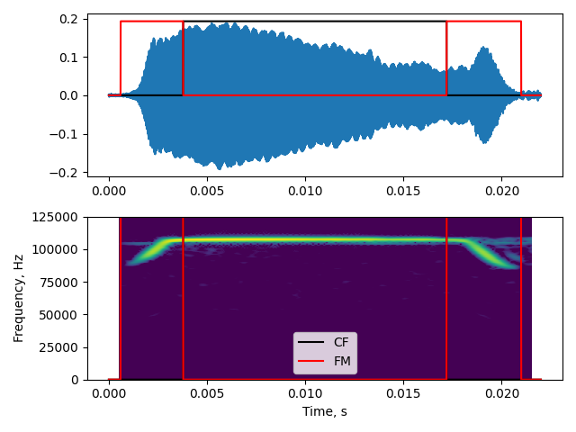

```{r, echo=FALSE}
library(knitr)
library(kableExtra)
library(magrittr)
knitr::opts_chunk$set(fig.pos = 'H')
```
## Things to be done 
1. Fix the tables - they're a mess
1. Complete Abstract


## Abstract {-#abstractitsfm}
Miaowe miaow miaow miaow miaow Miaowe miaow miaow miaow miaow Miaowe miaow miaow miaow miaow . Miaowe miaow miaow miaow miaow Miaowe miaow miaow miaow miaow Miaowe miaow miaow miaow miaow .Miaowe miaow miaow miaow miaow Miaowe miaow miaow miaow miaow .Miaowe miaow miaow miaow miaow Miaowe miaow miaow miaow miaow .Miaowe miaow miaow miaow miaow.

\newpage

## Introduction  
Vocalisations are a window into the sensory, behavioural and biomechanical states of an animal [@green1979analysis;@metzner2016ultrasound]. Echolocating animals, and specifically echolocating bats present a nice example of how analysing vocalisations reveals the sensorimotor decisions of the animal. Echolocating bats emit loud calls and listen for returning echoes to detect objects [@griffin1958listening]. Bats are known to flexibly alter various aspects of their calls to optimise echo detection, and thus their own sensory input. For instance, bats flying in the open emit long calls with a narrow bandwidth, and switch to short high-bandwidth frequency modulated sweeps as they are about attack an insect prey [@].


Whether a sound is CF or FM can reveal a lot about the biomechanics (muscular control, wing movement) being exerted at the point of sound production. Moreover, quantifying the dynamics of the sound itself can reveal the sensory adaptations and/or biomechanical capabilities of the animal. For instance, a roosting echolocating bat that is probing its surroundings will emit echolocation calls of about 3-5ms at about 10 calls/seconds [Ratcliffe review], while the same bat that is about to catch an insect can produce very short calls of around 1 ms rapidly at rates close to 200 calls/second [Coenfastmuscles]. Bats are also known to alter the bandwidth and sweep rate of their calls in a context-dependent manner, revealing the complex sensorimotor heuristics they use to optimise their own sensory inputs [batbioacoustics]. While most bats emit mainly FM echolocation calls, about X% of all bats emit calls with both CF and FM components in them, the so-called CF-FM calls.


```{r, echo=FALSE}
# The analysis of bat calls has been greatly helped by the advent of acoustic packages and the spread of programming literacy, but there is still a long way to go. Here, I discuss the case of CF-FM bat call studies and the need for changes in call-processing 
# field of CF-FM bat echolocation is a
```

In CF-FM bats, a lot of research focus has gone primarily into the CF Doppler shifting behaviour (Siemers, Beedlholm etc.), and relatively less about how bats alter the sub-parts of their calls. Tian & Schnitzler 1997: define FM as 0.8kHz (also, about 1 % of CF peak) below 2nd harmonic of 'CF component' - measure duration and other parameters after segmentation.


* Vater et al. 2003: durations of CF +FM and FM bandwidth seem to be measured manually from a spectrogram
* Hage et al. JEB 2012 : iFM and tFM bandwidths measured by automatically measuring peak frequency at start, middle and end of the call - actually kind of neat..hmm. And fully automated
* Fawcett et al. 2015, JEB : Measure tFM and iFM duration using a 256 point FFT window + min freq (-10dB peak frequency) -- but don't specify how the FM components were selected. It seems like they were done manually. 
* Schoeppler et al 2018, Sci. Rep: define FM as 660 Hz (~1% of CF peak freq.) below the CF2 frequency. *H. armiger*. Tracked frequency with a spectrogram??
* Lu et al. 2020, JEB : CF and FM segmented by an elliptic filter set at 2kHz below the CF peak frequency. *H. armiger* too , almost 3% of the peak frequency... In general there is a lack of uploaded scripts, focus on proprietary software and in particular a general sparsity of description of methods. 
* Gessinger et al. 2020, RSOS: studying QCF calls of L. aurita. To calculate CF peak frequency, seem to manually discard the initial and end parts of the call. While maybe reasonable - not very well scalable with increasing number of samples

- While the focus of this package has been on CF-FM calls, the use of ```itsfm```, its use need not be restricted to only echolocation calls - but can be used to study any sound.

## Package description 
```itsfm``` currently provides two main approaches to segment the CF and FM components of a sound (Figure \@ref(fig:cffmseg)), the 'peak-percentage' and 'pwvd' methods. 


```{r cffmseg, echo=FALSE,fig.cap="Diagnostic plot showing the CF/FM segmentation output of a \\textit{Rhinolophus euryale/mehelyi} call"}

```


### Peak-percentage segmentation 
The ```peak-percentage``` method is best for sounds with one or more dominant CF components of the same frequency, and FM components that are below the CF component's frequency (Figure \ref{fig:peak-percentage}). A typical rhinolophid/hipposiderid CF-FM call is the simplest example for which this method works. This method's implementation is inspired by previously published efforts to segment CF-FM calls into their respective components [luetal2020,tianschnitzler,schoeppleretal]. The approach implemented here creates two versions of the raw audio that are low and high passed at a threshold frequency. The threshold frequency is calculated as a fixed percentage of the raw audio's peak frequency, eg. 99%. The dB rms profile of the low and high passed audio are then calculated and compared by subtraction. Continuous regions where the low-passed audio is greater than the high-passed audio are considered FM regions, and CF regions where it is vice-versa (Figure \ref(pkpctdiags)).

```{r pkpctgdiags, echo=FALSE,fig.cap="hello whateverhello whatever hello whatever hello whatever hello whatever"}

```

The peak-percentage method is relatively easy to parameterise as it accepts two intuitive input parameters, the ```peak_percentage``` (peak percentage value between 0-1) and ```window_size``` (the number of samples for the window used to calculate the dB rms profile over). A set of additional optional parameters may also be specified. The default low/high pass filter used is a second order elliptic filter with 3dB ripple (pass band) and 10dB minimum attenuation in the stop band. The user may also optionally specify their own recursive filter coefficients. 

A major drawback in the peak-percentage method is its limited use-cases. Sounds must be sufficiently similar to the ideal input spectro-temporal shape of a classic CF-FM call, or they will be mis-segmented. Not even all CF-FM calls are likely to be segmented properly, eg. approach calls with shorter CF segments and longer FM segments. If the CF segment of the input sound does not contribute majorly to the spectrum, then the peak-percentage method fails. Experience with field recordings having off-axis CF-FM bat calls shows that the peak-percentage method also fails here because the CF component may not be as dominant as in on-axis recordings of the same call. Despite the limitations in the types of sounds that can be segmented, the peak-percentage method may also be used for certain types of bird calls with long CF and short FM calls (eg. those emitted by the *Pachycephala* genus)

### PWVD segmentation 
The ```pwvd``` method  (Figure \ref{fig:fmratediags}) tracks the frequency modulation over the course of the input sound. Regions with an above threshold frequency modulation are considered FM regions, and those below are considered CF regions. The frequency modulation over the course of a sound is estimated by first generating a a sample-level 'frequency profile' through the use of the Pseudo Wigner-Ville Distribution (PWVD). The PWVD  is a relatively underutilised method in bioacoustics [but see Paper1,Paper2,Paper3] which generates time-frequency representations with high spectro-temporal resolution [PWVD book]. The first derivative of the frequency profile is used to generate the frequency modulation rate profile of the sound and thus segment regions that are above or below the threshold. 


```{r fmratediags, echo=FALSE,fig.cap="Diagnostic plots showing the frequency tracking of a CF-FM call. The raw frequency profile is susceptible to edge effects and shows a lot of variation at the edges. The correction algorithms are able to stabilise the frequency estimate by interpolating and extrapolating between non-problematic regions. The downsampled version of the corrected frequency profile is used to calculate the frequency modulation rate over time."}
include_graphics('examples/pwvd_fmrate_diagnostic.png')
```

The ```pwvd``` method requires somewhat more parametrisation and methodological understand than the ```peak-percentage``` method. Its effectiveness is dependent on the ```fmrate_threshold``` (frequency modulation threshold, in kHz/ms), ```pwvd_window``` size (number of samples used to form the 'slices' of the time-frequency representation), ```tfr_cliprange``` (permitted dynamic range in dB, used to clip the time-frequency representation and remove noise). In addition to these primary parameters, the ```pwvd``` method can be further fine-tuned to improve segmentation. The  frequency profile is currently generated by tracking the dominant frequency over each slice of the PWVD representation. The dominant frequency approach is susceptible to noise and changes in sound levels over time, and thus requires additional correction routines that interpolate between problematically tracked regions. The problematic regions are identified by measuring the accelaration (second derivative) of the sound's frequency profile. Regions above a user-set threshold are considered 'spiky' and are interpolated or extrapolated based on neighbouring regions frequency estimates. 

Even though the ```pwvd``` method requires some effort to parameterise, the flexibility it provides allows the analysis of a much wider-range of sounds than the ```peak-percentage``` method. The CF/FM segmentation is independent of the actual call shape, and even complex sounds such as bat social calls and bird songs could be segmented through this method. A major drawback of the current ```pwvd``` implementation is its inability to reliably segment multi-harmonic sounds. Multi-harmonic sounds present a challenge for the simple dominant-frequency based frequency tracking in place currently, and alternative algorithms will be a focus of future development. 

### Supporting methods

Along with the primary methods that segment sounds into their component CF and FM regions, ```itsfm``` has a collection of supporting methods that allow quantification, visualisation and batch-processing. A series of inbuilt measurement functions allow region-specific measurements such as duration, rms, peak-frequency, or terminal frequency to be measured. Custom measurements may also be specified for the user on each segmented region. A sound analysed with the ```pwvd``` method generates more than the identified CF/FM regions. Raw and noise-corrected data on the frequency profile of the sound and the rate of frequency modulation over time are of interest to researchers studying the speed at which vocalisations can be modulated from a behavioural and biomechanical viewpoint [@metzner;@Hage]. Along with the background data used to form the segmentations, ```itsfm``` also provides a series of inbuilt visualisation functions to visualise the input sound itself (```visualise_sound```) and generate diagnostic plots of the segmentation output through the ```itsFMInspector``` class and ```visualise_cffm_segmentation``` (Figure \ref(fig:cffmseg)). 

Handling audio recordings made in the field calls for the individual handling of each recording. To aid the reproducible processing of multiple files with unique input parameters ```itsfm``` can also be called through a command-line interface that accepts batch files in the form of the CSV format. The batch files contain column-wise input parameters for each row that defines the path to an audio file. To facilitate iterative parameter optimisation, the user can choose to select only a few audio recordings or the entire set of files defined in the batch file. For each processed audio file, the diagnostic plot and measurements are saved in the working folder.

The ```itsfm``` package also comes bundled with a series of field recordings of bat calls of various hipposiderid, rhinolophid and noctilionid  species. These field recordings allow the user to test the utility of the methods in the package, and gain familiarity with setting correct parameters. 

## Methods evaluation 

### Synthetic dataset creation and segmentation 

To test the accuracy of the segmentation methods implemented in the ```itsfm``` package, I generated a set of synthetic CF-FM calls with known segment durations and spectral properties. Synthetic calls were generated based on calls broadly based on the structure of rhinolophid and hipposiderid call parameters using the package's inbuilt ```make_cffm_call``` function. A set of 324 synthetic calls were made through a combination of parameters in Table \@ref(tab:synthtable). Each synthetic call consisted of an iFM, CF and tFM component (naming as per [@tian1997echolocation]), and is Tukey windowed without any padded silent samples or background noise. All synthetic calls were generated at a sampling rate of 250kHz. 

```{r synthtable, echo=FALSE}
cf.durations <- c(0.005,0.010,0.015)
cf.peakfreq <- c(40000, 60000, 90000)
fm.durations <- c(0.001, 0.002, NA)
fm.bw <- c(5000, 10000, 20000)

tabledata <- as.matrix(rbind(cf.durations, cf.peakfreq, fm.durations, fm.bw))
rownames(tabledata) <- c("CF duration (s)","CF peak frequency (kHz)","i/t FM duration (s)","i/t FM bandwidth (s)")

opts <- options(knitr.kable.NA = "")
knitr::kable(tabledata, col.names = c('', 'Parameter values', ''), digits=c(5,5,5), format.args = list(scientific = FALSE),
             caption="Parameter values used to generate synthetic CF-FM calls. The parameters broadly reflect the call shape of a rhinolophid/hipposiderid CFFM bat calls. iFM and tFM regions were generated from the same FM parameter set. 324 calls = 9 CF combintations x 6 iFM combinations x 6 tFM combinations.")
```

The synthetic calls were segmented according to method-specific parameters that were chosen optimised based on trial-and-error on a smaller representative batch. Specifically, the non-default parameter values for both segmentations are in Table \ref(tab:segparams)

```{r segparams, out.width=100,echo=FALSE}
pwvd.param.names <- c('Window size (samples)','FM rate threshold (kHz/ms)','Accelaration threshold (kHz/ms2)','Extrapolation window(s)')
pwvd.values <- c(125,2,10,75*10^-6)
peakpctg.param.names <- c('','peak percentage','double pass',NA)
peakpctg.value <- c(125, 0.99, 'True', NA)

segparams <- as.matrix(rbind(pwvd.param.names, pwvd.values, peakpctg.param.names, peakpctg.value))
rownames(segparams) <- c("pwvd","","peak_percentage","")

opts <- options(knitr.kable.NA = "")
kable(segparams, col.names = c('', '', '',''), digits=c(5,5,5,5), format.args = list(scientific = TRUE),
             caption="Parameter values used to generate synthetic CF-FM calls. The parameters broadly reflect the call shape of a rhinolophid/hipposiderid CFFM bat calls. iFM and tFM regions were generated from the same FM parameter set. 324 calls = 9 CF combintations x 6 iFM combinations x 6 tFM combinations.") %>% kable_styling(latex_options =c("striped","scale_down"))
```

The accuracy of segmentation was determined by comparing the duration of the obtained call components and the original values used to make the synthesied calls. The accuracy of other parameters eg. CF peak frequency, FM bandwidth was not assessed. It follows directly that if the call components have been poorly segmented, any measurements made from the underlying audio will also be unrepresentative of the actual call parameters. Some calls appeared to have more than three components due to false positive CF/FM identifications, and were not included in the accuracy calculations. 

### Results 
The ```pwvd``` method correctly identified 99% of all calls (322/324) as having only 3 components. The ```peak_percentage``` method correctly identified 94% of all calls as having 3 components (306/324). Both segmentation methods achieved a satisfactory performance. The ```pwvd``` method was comparitively superior to the ```peak_percentage``` method across all the parameter combinations and call components tested (Table \@ref(tab:performance)). 

The relatively lower overall performance of the  ```peak_percentage``` method can be specifically attributed to the call properties of certain synthetic calls. A further inspection of calls with lower than 0.8 accuracy in component duration revealed that calls with a high CF frequency (60 and 90 kHz) and at least one low bandwidth FM component (5kHz) appear to have been segmented with low accuracy. This is explained by the fact that the cutoff frequency of the recursive filter is set at 0.99 of the peak frequency. A low FM bandwidth call with a high CF frequency will have its cutoff frequency much below the actual CF frequency (600 and 900 Hz below peak frequency here). The lower cutoff frequency will thus lead to a shorter duration estimate of the low-bandwidth FM component. The accuracy of component durations was above 0.8 for all calls segmented with the ```pwvd``` method. 

What caused the false positive call component detections in the ```pwvd``` and ```peak_percentage``` methods? In the ```pwvd``` method, the false component detections consisted of very short ($\leq$ 0.1ms) adjacently located false positive CF and FM segments. These adjacent CF and FM segments were caused by brief alterations in the dB rms levels of the high and low-passed audio. The brief alterations in the dB rms levels are likely due to the combination of windowing function applied on the synthetic calls and edge effects during high/low pass filtering. Such edge effects may not necessarily occur during the processing of experimentally recorded calls, which may not have such sharp roll-offs in call level. The two cases where false components were detected with the ```pwvd``` method were borderline cases where false CF components were detected in what should have been an FM region of the call. On further inspection it was shown that the frequency tracking of these false CF components was indeed accurate, but the action of the error-correction routines caused a slight drop in the frequency modulation rate to 1.9 kHz/ms, just slightly below the threshold of 2.0 kHz/ms. The error-correction routines in ```pwvd``` are typically required when low signal-level causes jumps in the frequency estimate in the beginning and ends of the call. 


```{r performance, echo=FALSE,out.width="100%", fig.cap="\\label{fig:performance} asdf;lkj asdf;ljkwqrepoiu  asdffff"}
library(knitr)
include_graphics('accuracy/pwvd-pkpct-comparison.png')
```


```{r accuracypctiles, echo=FALSE}
d <- read.csv("accuracy/accuracy_pctiles.csv")
d$Region.type <- c("CF","CF","tFM","tFM","iFM","iFM")
d$method <- c("peak_percentage", "pwvd","peak_percentage", "pwvd","peak_percentage", "pwvd")
options(knitr.table.format = "latex")
knitr::kable(d, col.names = c("Call component", "Segmentation method", "Relative accuracy, 95 percentile range"),
             caption="Summary statistics describing the performance of the two segmentation methods on the synthetised test data set. The pwvd method performs better than the peak_percentage method over the tested parameter space and for all call components (iFM,tFM and CF).") 
```


## Discussion

- itsfm being open-source, should not have any access issues. The one primary requirement of course is that the user must have some kind of coding experience. However, with the use of a non-GUI platform, there's 

## Further venues for work
- The use of itsfm in other types of vocalisations still needs to be explored. For instance, bird calls have been analysed (See DOCSLINK). The current frequency tracking implementation only tracks a single frequency per point of time, and thus is not able to handle multi-harmonic sounds with equal harmonic emphasis very well. 
- Future implementations of frequency tracking need to apply more sophisticated problem-region detection and also frequency tracking (eg. Viterbi path)

## Open-source software and packages used
```itsfm``` is written in the Python language [], and relies on the numpy, scipy, matplotlib and tftb 

## Supporting information 
The ```itsfm``` package can be installed from the Python package index (PyPi) with the command ```pip install itsfm```. The latest versions of the package is accessible at [https://github.com/thejasvibr/itsfm](https://github.com/thejasvibr/itsfm). Online documentation with detailed examples and troubleshooting guides can be accessed at [https://itsfm.readthedocs.io](https://itsfm.readthedocs.io)


## Acknowledgements
I would like to thank Diana Schoeppler for sharing know-how on analysing CF-FM calls and Neetash MR for helpful discussions. This work was funded by the DAAD and the IMPRS for Organismal Biology. I'd like to thank the following people for contributing to the call recording library Aditya Krishna, Aiqing Lin, Gloria Gessinger, Klaus-Gerhard Heller, Laura Stidsholt,Neetash MR. 

## References 